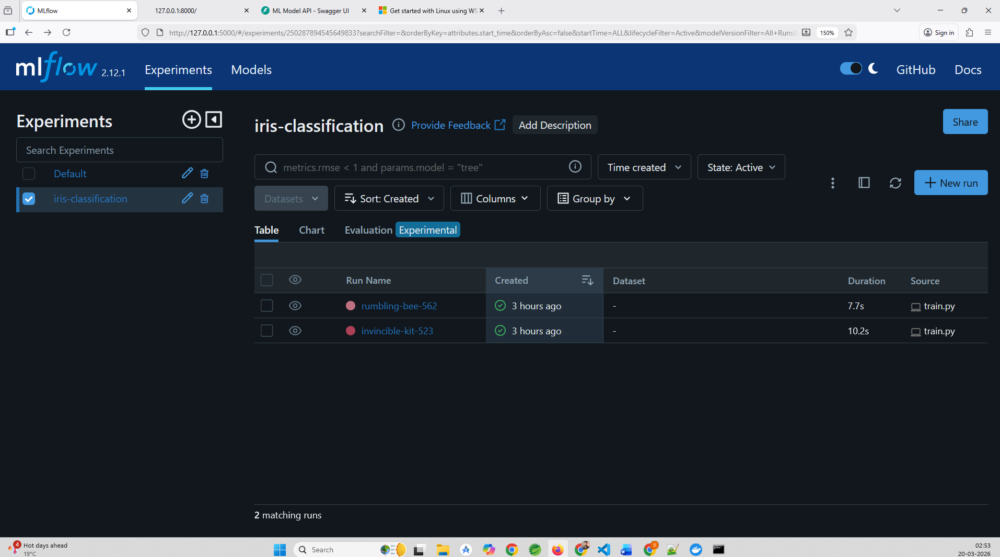
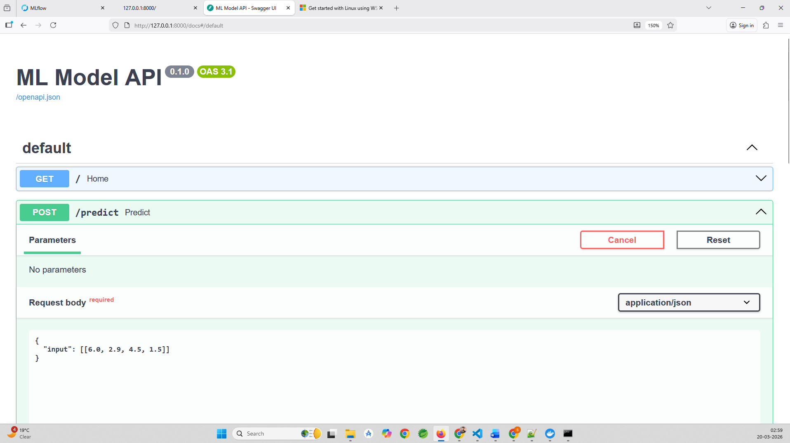
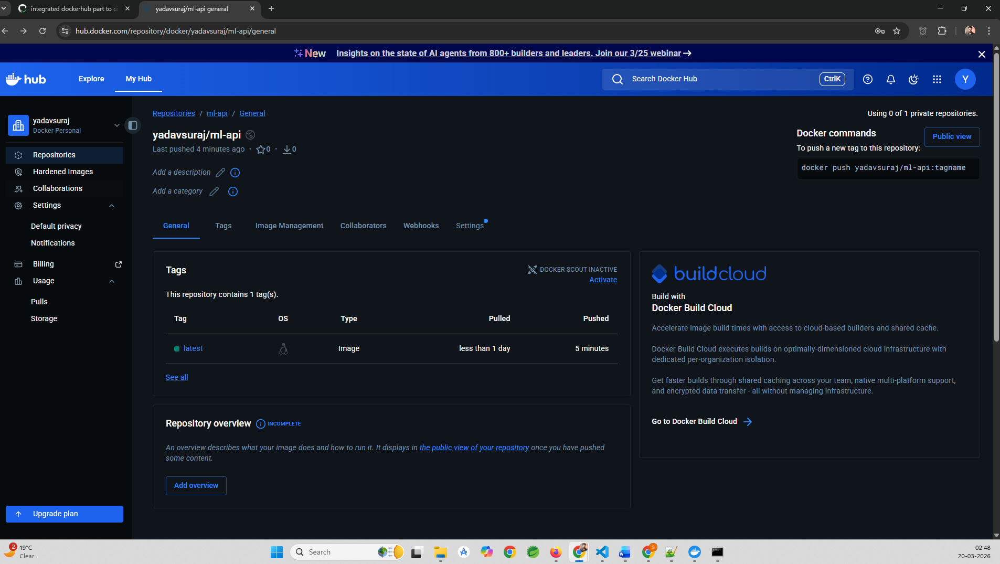

#  MLOps Assignment(Iris Data)

## Overview
This repository demonstrates an MLOps workflow covering model training, experiment tracking, API-based inference, containerization, and automated CI/CD.
The model can consistently predict the flower type (Setosa, Versicolor, Virginica)

## Tech Stack
- **Python 3.10**
- **MLflow** – Experiment tracking & model logging
- **Scikit-learn** – Model training
- **FastAPI** – Model serving
- **Docker** – Containerization
- **GitHub Actions** – CI/CD pipeline
- **DockerHub** – Image registry
- **Pytest** – Testing
- **Flake8** – Linting

##  Project Structure
```bash
mlops-assignment/
│
├── api/ # FastAPI application (model serving)
├── src/ # Model training (MLflow integration)
├── etl/ # ETL pipeline
├── tests/ # Test cases
├── mlruns/ # MLflow artifacts (local tracking)
├── data/ # Processed data output
├── .github/workflows/ # CI/CD pipeline (GitHub Actions)
├── Dockerfile
├── requirements.txt
├── README.md
└── .dockerignore
```
## Create Virtual Environment
```bash
python3.10 -m venv venv
```
## Acivate Virtual Environment
```bash
venv\Scripts\activate
```
## Machine Learning Pipeline
- Dataset: Iris (built-in from scikit-learn)
- Model: RandomForestClassifier
- Tracking:
  - Parameters
  - Metrics
  - Model artifacts via MLflow

## Train the model
python src/train.py

## MLflow UI
mlflow ui
Access UI at: http://127.0.0.1:5000



## API
uvicorn api.app:app --reload
Access at: http://127.0.0.1:8000/docs



.png)

## Testing
pytest
Coverage: API health check, Prediction endpoint validation

## Docker 
To build the image: 
```bash
docker build -t ml-api .
```
To run container:
```bash
docker run -p 8000:8000 ml-api
```
DockerHub Image: 
``` bash
docker pull <your-dockerhub-username>/ml-api:latest
```


## ETL Pipeline
- Generates synthetic dataset (~100k rows)
- Performs data cleaning (null handling, type conversion)
- Applies transformations (feature engineering, aggregations)
- Stores processed data in csv format
``` bash
python etl/etl.py
``` 

## CI/CD Pipeline
Implemented using GitHub Actions.

### Pipeline Stages
- Dependency installation
- Code linting (flake8)
- Unit testing (pytest)
- Docker image build
- Docker image push to DockerHub

## Metrics
The API exposes a /metrics endpoint that provides Prometheus-compatible metrics for monitoring.
- Metrics Tracked:
- Total API requests
- Average latency
- Drift detection count
- Model version

### Access Metrics
``` bash
http://127.0.0.1:8000/metrics
```
### Example output
``` bash
total_requests 5
average_latency 0.0023
drift_count 2
model_version{version="v1"} 1
```

## Security Best Practices
Credentials managed via GitHub Secrets
No sensitive data stored in repository
DockerHub authentication via access tokens
Clean .dockerignore and .gitignore usage